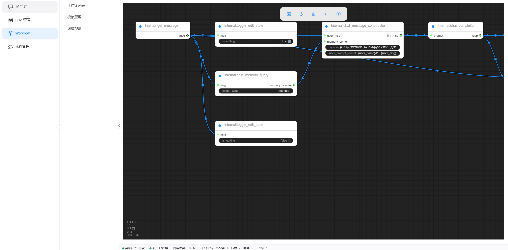
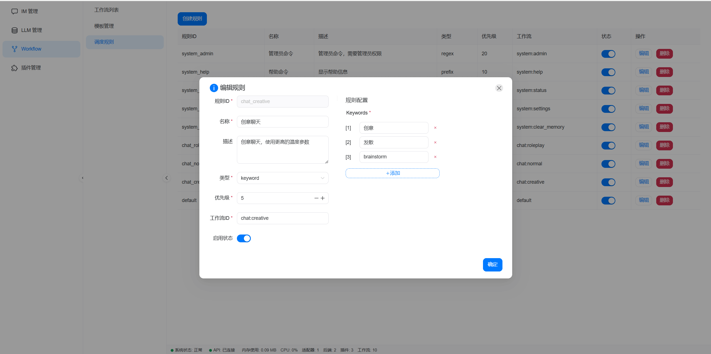

  <h1>Kirara Agent Framework WebUI</h1>

  
  
  
  

## 项目介绍

本项目是 [Kirara Agent Framework](https://github.com/lss233/chatgpt-mirai-qq-bot) 的前端管理面板，旨在提供一个用户友好的界面，方便用户管理和配置文件。  

🚧 **当前正在施工中，欢迎有兴趣的同学与开发！** 🚧

## 截图展示

<!-- 这里可以添加一些项目截图 -->
<!-- 例如: -->

## 如何参与开发

我们非常欢迎您参与到 Kirara Agent Framework WebUI 的开发中！在参与开发之前，请务必先进行讨论，以确保您的贡献能够更好地融入到项目中。

1.  **参与讨论**：在开始开发之前，请先在 issue 或 QQ 群：701933732 中讨论，提出您的想法和建议。
2.  **发起 Pull Request**：在充分讨论后，您可以 fork 本仓库，进行开发，并在完成后发起 Pull Request。
3.  **等待合并**：我们会尽快审核您的 Pull Request，并在确认无误后将其合并到主分支中。

## License

本项目采用 [MIT License](LICENSE) 开源协议。

## Credits

*   感谢 [Vite](https://vitejs.dev/) 提供前端构建工具
*   感谢 [Vue 3](https://vuejs.org/) 提供前端框架
*   感谢 [Naive UI](https://www.naiveui.com/) 提供 UI 组件
*   感谢 [LiteGraph](https://github.com/comfyorg/litegraph.js) 提供流程图编辑器
*   感谢 [LobeHub Icons](https://github.com/LobeHub/lobe-hub-icons) 提供 LLM 图标
*   感谢所有为本项目做出贡献的开发者
